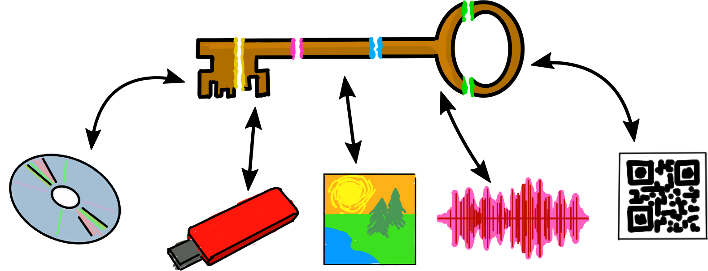

Horcrux: immortality for your encryption keys
=============================================

Horcrux is a Python script that glues a few well-known, trustworthy tools
together for "Voldemort-style" encrypted backups. You can encrypt new
files at any time, but decrypting them again requires gathering `N` of `M`
pieces of the master key.

Set up your horcruxes today, and stop worrying about getting hacked or
forgetting your password. Back parts of it up in separate locations: put them
on CDs or thumbdrives, give them to friends, hide them in pictures or audio
files, print them on metal plates in a vault guarded by a dragon. Be creative.

It's free and open source, of course. Tip whatever you think it's worth (links
at the bottom).  All I ask is during the next bull run, when you suddenly have
a scary amount of money, spare a thought for the little project that keeps it
from actually being scary!

Check out this readme, [usage.txt][1], or [an overly detailed example][2]
generated by [this script][3] to get started.

I'm just a normal person. Why do I need that?
---------------------------------------------

It sounds like overkill, but there really is no better way! My opinion is that
most normal people will eventually discover a need for something like this as
their lives come to depend more and more on passwords.

The problem is that storing digital secrets is tricky because two bad things could happen:

1. you lose your secret
2. someone steals your secret

Both are pretty bad if the secret is your master password or some cryptocurrency.
And what's worse, being safer from one generally makes you more vulnerable to the other...
Wrote your password on paper? Someone might read it.
Carefully memorized a long mnemonic passphrase?
You might hit your head and forget it, or you might be in a coma.

_This scheme is the simplest, most effective way to protect against both risks at once._

It also has several other advantages:

* You can pick pick how worried you are about each:
  use higher `N` (keys needed to decrypt) if you worry more about theft,
  or higher `M` (keys total) if you worry more about losing access.

* The time and effort needed to assemble the pieces offers some protection from
  being physically robbed, or (much more likely) losing money on impulsive crypto trades.

* It can be both a backup and a will. Distribute shares to family members
  along with a `horcrux sign`ed document explaining what you want done when you die.

How does it work?
-----------------

All the keys are made with one command, like `horcrux setup 3 5 my-first-horcruxes`.
What it does is:

1. Generate a random master password and break it into 5 shares using
   [Shamir's secret sharing scheme][4], with 3 of the 5 required to reconstruct it.

2. Generate an encrypt/decrypt [GPG keypair][5] and encrypt the private (decrypt)
   key with the master password.

3. Generate a separate sign/verify GPG keypair for signature checking.

These files are created in the `my-first-horcruxes` directory:

* `encrypt.key` for encrypting secrets (keep this)
* `sign.key` for signing secrets (keep this)
* `verify.key` for checking signatures (keep + distribute this)
* `decrypt.key` for decrypting (keep + distribute this; it's locked with the shares)
* 5 `share-XX.key` master password shares (distibute and/or keep in separate locations)

Now all you have to do is distribute them, encrypt some stuff,
and test that you really can bring any 3 horcruxes together to decrypt!

There are also some extra commands to help with distribution: `hide` to hide a
horcrux in a photo or audio file, `unhide` to get it back, and `qrcode` to
generate a QR code of it, suitable for printing. (NOTE: qrcodes not implemented yet)

When you encrypt something with Horcrux it automatically signs it with your
`sign.key`. That way when you distribute it to friends or family they can use
`verify.key` to check that the file is correct (actually from you and not
corrupted during transfer), even though they can't open it.

Can I trust you?
----------------

No. I mean, yes, but there's no way to prove that and you shouldn't rely on it.
Instead you should take some common-sense security measures. In order of importance:

1. Set it up in an isolated environment like [TAILS][8] (see below), make sure
   everything works, then never connect it to the internet again after generating
   your keys.

2. If you can you should read the source code. It's about 400 lines of Python.
   Alternatively, Horcrux can print out all the commands as it runs them (add `-v`).
   (NOTE: partially implemented)
   You could re-run them yourself separately.
   Then you only have to trust the TAILS + Debian developers.

3. Right after generating your master password, open it in a text editor and
   manually change some characters. This protects against bugs in the system
   random number generator or me somehow having it generate easy-to-guess passwords.
   Horcrux will prompt you to do that. (NOTE: not implemented yet)

The offline environment might seem like too much work, but is necessary if you
want to protect something important, like cryptocurrency or highly sensitive documents.
Computers get hacked all the time! The other two are optional.

TAILS install
-------------

Horcrux should work anywhere you can install the following apt dependencies or
their equivalents:

* gnupg
* pwgen
* python 2.7
* python-docopt
* python-gnupg
* ssss
* steghide (optional, for hide and unhide)
* qrencode (optional, for QR codes)

You need root access for steghide, but only if you want to hide horcruxes in
images or audio files.

I recommend doing everything in [TAILS][8] because it's portable, relatively simple
to set up, leaves no trace of your keys on disk, and will work on a different
computer in the future. You'll need to:

1. Download and install TAILS on a USB drive,
   enable persistent storage with apt cache, and reboot.

2. Clone this repository somewhere in `/live/persistent/TailsData_unlocked`,
   and optionally add it to your `PATH`.

3. Put the above dependencies in `live-additional-software.conf` in that folder too,
   then reboot and wait a couple minutes for them to be automatically installed.

4. Check that `./horcrux --help` runs, then play around making a couple test horcruxes.

5. Reboot one more time so you can `Disable all networking` at the startup
   screen before generating your real keys.

You can also repeat these steps to make a "Horcrux live USB" for friends and
family. Copy the `verify.desktop` and `decrypt.desktop` launchers into their
`~/Persistent` so they can drag the backup folder onto them to verify and/or
decrypt the backups, depending which keys you give them. Of course, you can
give them just the horcrux itself if you plan to be around to decrypt it.

Qubes install
=============

Another good option for advanced users is [Qubes][6]. You shouldn't install it
just for this, but if you use it already then a minimal offline VM (vault) is a
reasonable place to keep the Horcrux program along with your sign, encrypt, and
(locked) decrypt keys. Simply install the dependencies in the TemplateVM. This
setup has the advantage of making it easier to horcrux-encrypt your files,
because you don't need to reboot into TAILS each time. It may also work with
[Qubes Split GPG][7], although I haven't tried.

Donations
=========

I accept donations of any other crypto too! Just email or open an issue.

Bitcoin: 1PEhbpXYrtwK4JWfrrhCcWt4sgxijc9CT7

Bitcoin Cash: 1EybRPMNwW5EnP7rGtMGnP1BZzn284b2vi

Litecoin: MBBgdzToFS3aY2yrqu4F42RLvoo8iw6cNF

[1]: ./usage.txt
[2]: ./example.log
[3]: ./example.sh
[4]: https://en.wikipedia.org/wiki/Shamir%27s_Secret_Sharing
[5]: https://www.gnupg.org
[6]: https://www.qubes-os.org
[7]: https://www.qubes-os.org/doc/split-gpg/
[8]: https://tails.boum.org/
